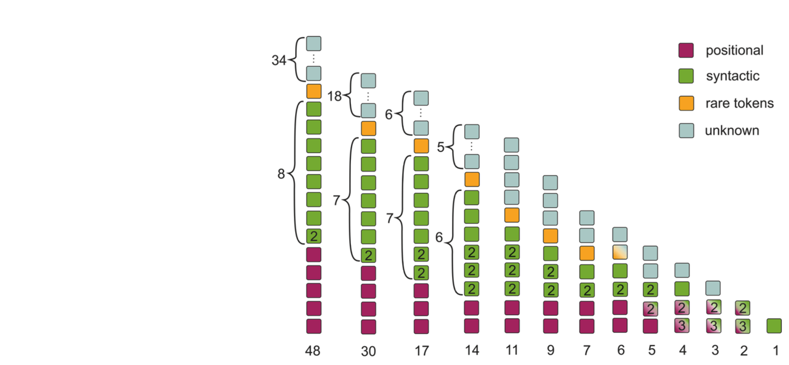
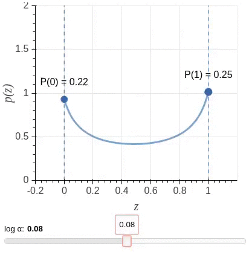

## The Story of Heads


This is the official repo for the following papers:
* [Analyzing Multi-Head Self-Attention: Specialized Heads Do the Heavy Lifting, the Rest Can Be Pruned](https://www.aclweb.org/anthology/P19-1580) (ACL 2019)
* [Analyzing the Source and Target Contributions to Predictions in Neural Machine Translation](https://arxiv.org/pdf/2010.10907.pdf) - code for this one will appear in November!



In this README, we discuss the ACL 2019 heads paper. Read the official [blog post](https://lena-voita.github.io/posts/acl19_heads.html) for the details!

For the contributions paper, look here: [TO BE UPDATED in November]().

#### Bibtex
```
@inproceedings{voita-etal-2019-analyzing,
    title = "Analyzing Multi-Head Self-Attention: Specialized Heads Do the Heavy Lifting, the Rest Can Be Pruned",
    author = "Voita, Elena  and
      Talbot, David  and
      Moiseev, Fedor  and
      Sennrich, Rico  and
      Titov, Ivan",
    booktitle = "Proceedings of the 57th Annual Meeting of the Association for Computational Linguistics",
    month = jul,
    year = "2019",
    address = "Florence, Italy",
    publisher = "Association for Computational Linguistics",
    url = "https://www.aclweb.org/anthology/P19-1580",
    pages = "5797--5808",
}
```

Table of Contents
=================

   * [Introduction](#introduction)
      * [Pruning Attention Heads](#pruning-attention-heads)
   * [Experiments](#experiments)
      * [Requirements](#requirements)
      * [Data preprocessing](#data-preprocessing)
         * [Tokenization](#tokenization)
         * [BPE-ization](#bpe-ization)
      * [Model training](#model-training)
      * [Notebooks: how to use a model](#notebooks-how-to-use-a-model)
      * [Training config tour](#training-config-tour)
         * [Data](#data)
         * [Model](#model)
         * [Problem (loss function)](#problem-loss-function)
         * [Starting checkpoint](#starting-checkpoint)
         * [Variables to optimize](#variables-to-optimize)
         * [Batch size](#batch-size)
         * [Other options](#other-options)
   * [Comments](#comments)


# Introduction

In the paper, we:

* evaluate the importance of attention heads in Transformer,

* identify functions of the most important encoder heads,

* prune the vast majority of attention heads in Transformer without seriously affecting quality using a method based on stochastic gates and a differentiable relaxation of the L0 penalty,

* show which types of model attention are most sensitive to the number of attention heads and on which layers.

In this repo, we provide code and describe steps needed to reproduce our experiments with the L0 head pruning.

## Pruning Attention Heads

In the standard Transformer, results of different attention heads in a layer are concatenated:

```MultiHead(Q, K, V ) = Concat(head_i)W^O.```

We modify the original Transformer architecture by multiplying the representation computed by each `head_i` by a scalar gate `g_i`:

```MultiHead(Q, K, V ) = Concat(g_i * head_i)W^O.```

Unlike usual gates, `g_i` are parameters specific to heads and are independent of the input (i.e. the sentence). As we would like to disable less important heads completely, we would ideally apply `L0` regularization to the scalars `g_i`. The L0 norm equals the number of non-zero components and would push the model to switch off less important heads.

Unfortunately, the L0 norm is nondifferentiable and so cannot be directly incorporated as a regularization term in
the objective function. Instead, we use a stochastic relaxation.
Each gate `g_i` is a random variable drawn independently from a head-specific [Hard Concrete distribution](https://openreview.net/pdf?id=H1Y8hhg0b). The distributions have non-zero probability mass at 0 and 1; look at the illustration. 



We use the sum of the probabilities of heads being non-zero (`L_C`) as a stochastic relaxation of the non-differentiable `L0` norm. The resulting training objective is:

```L = L_xent + λ * L_C.```

When applying the regularizer, we start from the converged model trained without the `L_C` penalty (i.e. the parameters are
initialized with the parameters of the converged model) and then add the gates and continue training the
full objective. By varying the coefficient `λ` in the optimized objective, we obtain models with different numbers of retained heads. Below is shown how the probabilities of encoder heads being completely closed (P(g_i)=0) change in training for different values of `λ` (pruning starts from a converged model). White color denotes P(g_i=0) = 1, which means that a head is completely removed from the model.


(Gif is for the model trained on EN-RU WMT. For other datasets, values of `λ` can be different.)

We observe that the model converges to solutions where gates are either almost completely closed or completely open. This means that at test time we can treat the model as a standard Transformer and use only a subset of heads.

---
# Experiments

## Requirements

__Operating System:__ This implementation works on the most popular Linux distributions (tested on Ubuntu 14, 16). It will also likely to work on Mac OS. For other operating systems we recommend using Docker.

__Hardware:__ The model can be trained on one or several GPUs. Training on CPU is also supported.

__OpenMPI(optional):__ To train on several GPUs, you have to install OpenMPI. The code was tested on [OpenMPI 3.1.2(download)](https://download.open-mpi.org/release/open-mpi/v3.1/openmpi-3.1.2.tar.gz). See build instructions [here]( https://www.open-mpi.org/faq/?category=building#easy-build).

__Python:__ The code works with Python 3.5 and 3.6; we recommend using [anaconda](https://www.anaconda.com/). Install the rest of python packages with `pip install -r requirements.txt`. If you haven't build OpenMPI, remove `horovod` from the list of requirements.

## Data preprocessing
The model training config requires the data to be preprocessed, i.e. tokenized and bpeized. 
### Tokenization
Here is an example of how to tokenize (and lowercase) you data:
```
cat text_lines.en | moses-tokenizer en | python3 -c "import sys; print(sys.stdin.read().lower())" > text_lines.en.tok
```

For the OpenSubtitles18 dataset, you do not need this step since the data is already tokenized (you can just lowercase it).

### BPE-ization
Learn BPE rules:
```
subword-nmt learn-bpe -s 32000 < text_lines.en.tok > bpe_rules.en
```
Apply BPE rules to your data:
```
/path_to_this_repo/lib/tools/apply_bpe.py  --bpe_rules ./bpe_rules.en  < text_lines.en.tok > text_lines.en.bpeized
```
---
## Model training

In the [scripts](./scripts) folder you can find files `train_baseline.sh`, `train_concrete_heads.sh` and `train_fixed_alive_heads.sh` with configs for training baseline, model with heads pruning using relaxation of the L0 penalty, and model with a fixed configuration of open and closed heads. 

To launch an experiment, do the following (example is for the heads pruning experiment):
```
mkdir exp_dir_name && cd exp_dir_name
cp the-story-of-heads_dir/scripts/train_concrete_heads.sh .
bash train_concrete_heads.sh
```

After that, checkpoints will be in the `exp_dir_name/build/checkpoint` directory, summary for tensorboard - in `exp_dir_name/build/summary`, translations of dev set for checkpoints (if specified; see below) in `exp_dir_name/build/translations`.

---
## Notebooks: how to use a model
In the [notebooks](./notebooks) folder you can find notebooks showing how to deal with your trained model. From a notebook name it's content has to be clear, but I'll write this just in case.

[1_Load_model_and_translate](./notebooks/1_Load_model_and_translate.ipynb) - how to load model and translate sentences;

[2_Look_at_attention_maps](./notebooks/2_Look_at_attention_maps.ipynb) - how to draw attention maps for encoder heads;

[3_Look_which_heads_are_dead](./notebooks/3_Look_which_heads_are_dead.ipynb) - if you are pruning heads, you might want to know which ended up dead; this notebook shows you how to do this.


---
## Training config tour

Each training script has a thorough description of the parameters and explanation of the things you need to change for your experiment. Here we'll provide a tour of the config files and explain the parameters once again.


### Data
First, you need to specify your directory with the [the-story-of-heads](https://github.com/lena-voita/the-story-of-heads) repo, data directory and train/dev file names.
```
REPO_DIR="../" # insert the dir to the the-story-of-heads repo
DATA_DIR="../" # insert your datadir

NMT="${REPO_DIR}/scripts/nmt.py"

# path to preprocessed data (tokenized, bpe-ized)
train_src="${DATA_DIR}/train.src"
train_dst="${DATA_DIR}/train.dst"
dev_src="${DATA_DIR}/dev.src"
dev_dst="${DATA_DIR}/dev.dst"
```
After that, in the config you'll see the code for creating vocabularies from your data and shuffling the data.

---
### Model
```
params=(
...
--model lib.task.seq2seq.models.transformer_head_gates.Model
...)
```
This is the Transformer model with extra options for attention head gates: stochastic, fixed or no extra parameters for the baseline. Model hyperparameters are split into groups:
* main model hp,
* minor model hp (probably you do not want to change them)
* regularization and label smoothing
* inference params (beam search with a beam of 4)
* head gates parameters (for the baseline, nothing is here)

For the baseline, the parameters are as follows:
```
hp = {
     "num_layers": 6,
     "num_heads": 8,
     "ff_size": 2048,
     "ffn_type": "conv_relu",
     "hid_size": 512,
     "emb_size": 512,
     "res_steps": "nlda", 
    
     "rescale_emb": True,
     "inp_emb_bias": True,
     "normalize_out": True,
     "share_emb": False,
     "replace": 0,
    
     "relu_dropout": 0.1,
     "res_dropout": 0.1,
     "attn_dropout": 0.1,
     "label_smoothing": 0.1,
    
     "translator": "ingraph",
     "beam_size": 4,
     "beam_spread": 3,
     "len_alpha": 0.6,
     "attn_beta": 0,
    }
```
This set of parameters corresponds to Transformer-base [(Vaswani et al., 2017)](https://papers.nips.cc/paper/7181-attention-is-all-you-need). 

To train the model with heads pruning, you need to specify the types of attention heads you want to prune. For encoder self-attention heads only, 
```
    "concrete_heads": {"enc-self"},
```
and for all attention types, it's
```
    "concrete_heads": {"enc-self", "dec-self", "dec-enc"},
```

For fixed head configuration, specify gate values for each head:
```
     "alive_heads": {"enc-self": [[1,0,1,0,1,0,1,0],
                                  [1,1,1,1,1,1,1,1],
                                  [0,0,0,0,0,0,0,0],
                                  [1,1,1,0,0,1,0,0],
                                  [0,0,0,0,1,1,1,1],
                                  [0,0,1,1,0,0,1,1]],
                    },
```
In this case, only encoder self-attention heads will be masked. For all attention types, specify all gates:
```
     "alive_heads": {"enc-self": [[1,0,1,0,1,0,1,0],
                                  [1,1,1,1,1,1,1,1],
                                   ...
                                  [0,0,1,1,0,0,1,1]],
                     "dec-self": [[...],
                                   ...,
                                  [...]],
                     "dec-enc": [[...],
                                  ...,
                                 [...]],
                    },
```
---
### Problem (loss function)
You need to set the training objective for you model. For the baseline and fixed head configuration, it's the standard cross-entropy loss with no extra options:
```
params=(
    ...
    --problem lib.task.seq2seq.problems.default.DefaultProblem
    --problem-opts '{}'
    ...)
```
For pruning heads, loss function is `L = L_xent + λ * L_C.`. You need to set another problem and specify the value of `λ`:
```
params=(
    ...
     --problem lib.task.seq2seq.problems.concrete.ConcreteProblem
     --problem-opts '{'"'"'concrete_coef'"'"': 0.1,}'
    ...)
```
---
### Starting checkpoint
If you start model training from already trained model (for example, we start pruning heads from the trained baseline model), specify the initial checkpoint:
```
params=(
    ...
     --pre-init-model-checkpoint 'dir_to_your_trained_baseline_checkpoint.npz'
    ...)
```
You do not need this if you start from scratch.

---
### Variables to optimize
If you want to freeze some sets of parameters in the model (for example, when pruning encoder heads we freeze the decoder parameters to ensure that heads functions do not move to the decoder), you have to specify which parameters you **want** to optimize. To optimize only encoder, add `variables` to `--optimizer-opts`:
```
params=(
    ...
    --optimizer-opts '{'"'"'beta1'"'"': 0.9, '"'"'beta2'"'"': 0.998,
                       '"'"'variables'"'"': ['"'"'mod/emb_inp*'"'"',
                                             '"'"'mod/enc*'"'"',],}'
    ...)
```
(Here `beta1` and `beta2` are parameters of the adam optimizer).

---
### Batch size
It has been shown that Transformer’s performance depends heavily on a batch size (see for example [Popel and Bojar, 2018](https://content.sciendo.com/view/journals/pralin/110/1/article-p43.xml)), and we chose a large value of batch size to ensure that models show their best performance. In our experiments, each training batch contained a set of translation pairs containing approximately 16000 source tokens. This can be reached by using several of GPUs or by accumulating the gradients for several batches and then making an update. Our implementation enables both these options.

Batch size per one gpu is set like this:
```
params=(
    ...
     --batch-len 4000
    ...)
```
The effective batch size will be then `batch-len * num_gpus`. For example, with `--batch-len 4000` and `4 gpus` you would get the desirable batch size of 16000.

If you do not have several gpus (often, we don't have either :) ), you still have to have models of a proper quality. For this, accumulate the gradients for several batches and then make an update. Add `average_grads: True` and `sync_every_steps: N` to the optimizer options like this:
```
params=(
    ...
    --optimizer-opts '{'"'"'beta1'"'"': 0.9, '"'"'beta2'"'"': 0.998,
                       '"'"'sync_every_steps'"'"': 4,
                       '"'"'average_grads'"'"': True, }'
    ...)
```
The effective batch size will be then `batch-len * sync_every_steps`. For example, with `--batch-len 4000` and `sync_every_steps: 4` you would get the desirable batch size of 16000.


---
### Other options
If you want to see dev BLEU score on your tensorboard:
```
params=(
    ...
      --translate-dev
      --translate-dev-every 2048
    ...)
```
Specify how often you want to save a checkpoint:
```
params=(
    ...
      --checkpoint-every-steps 2048
    ...)
```
Specify how often you want to score the dev set (eval loss values):
```
params=(
    ...
      --score-dev-every 256
    ...)
```
How many last checkpoints to keep:
```
params=(
    ...
       --keep-checkpoints-max 10
    ...)
```

---

# Comments
* `lib.task.seq2seq.models.transformer_head_gates` model enables you to train baseline as well as other versions, but if you want Transformer model without any modifications, you can find it here: `lib.task.seq2seq.models.transformer`.
