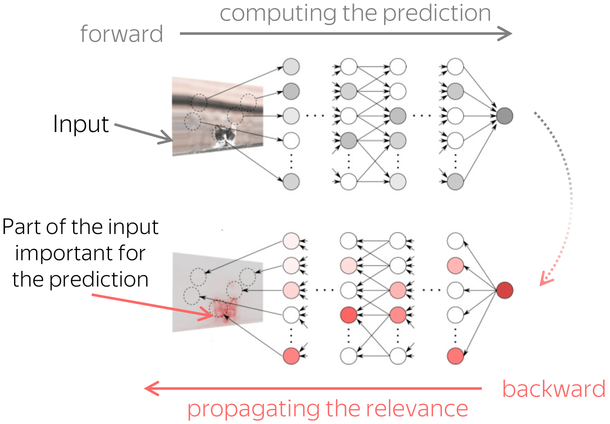

# Analyzing Source and Target Contribution to NMT Predictions


In this part, we discuss experiments from the paper [Analyzing the Source and Target Contributions to Predictions in Neural Machine Translation](https://arxiv.org/pdf/2010.10907.pdf).

For more details, look at the [blog post](https://lena-voita.github.io/posts/source_target_contributions_to_nmt.html)!
		
#### Bibtex
```
@misc{voita2020analyzing,
      title={Analyzing the Source and Target Contributions to Predictions in Neural Machine Translation}, 
      author={Elena Voita and Rico Sennrich and Ivan Titov},
      year={2020},
      booktitle = "{{arXiv}:2010.10907}",
      url = "https://arxiv.org/abs/2010.10907",
}
```

Table of Contents
=================

   * [What is this about?](#what-is-this-about)
   * [Evaluate LRP](#evaluating-lrp)
   * [Models](#models)


# What is this about?


	
In NMT, each prediction is based on two types of context: the source and the prefix of the target sentence. We show how to evaluate the relative contributions of source and target to NMT predictions and find that:

* models suffering from exposure bias are more prone to over-relying on target history (and hence to hallucinating) than the ones where the exposure bias is mitigated;

* models trained with more data rely on the source more and do it more confidently;

* the training process is non-monotonic with several distinct stages.


# Models

## Word Dropout

## Minimum Risk Training


# Evaluating LRP and Aggregating the Results


[1_Load_model_and_evaluate_LRP](./notebooks/1_Load_model_and_evaluate_LRP.ipynb) - load a model and evaluate LRP for a dataset;

[2_Load_LRP_results_and_build_graphs](./notebooks/2_Load_LRP_results_and_build_graphs.ipynb) - load LRP results we've built before and plot the graphs.
