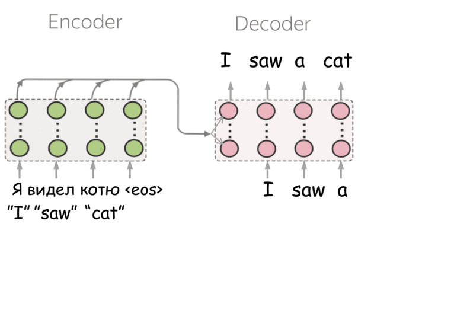
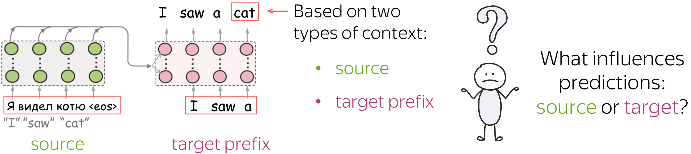

# Analyzing Source and Target Contribution to NMT Predictions




In this part, we discuss experiments from the ACL 2021 paper [Analyzing the Source and Target Contributions to Predictions in Neural Machine Translation](https://arxiv.org/pdf/2010.10907.pdf).

For more details, look at the [blog post](https://lena-voita.github.io/posts/source_target_contributions_to_nmt.html)!
		
#### Bibtex
```
@InProceedings{voita2021analyzing,
    title={Analyzing the Source and Target Contributions to Predictions in Neural Machine Translation},
    author={Elena Voita and Rico Sennrich and Ivan Titov},
    booktitle = "Proceedings of the 59th Annual Meeting of the Association for Computational Linguistics",
    month = aug,
    year = "2021",
    address = "Online",
    publisher = "Association for Computational Linguistics",
    url = "https://arxiv.org/pdf/2010.10907.pdf",
}
```
__Important!__ Please use the arXiv version of the paper: it has more accurace results with the updated version of the LRP code (big thanks to Wenxu Li for noticing an error in the first version of our code!).

### Table of Contents

   * [What is this about?](#what-is-this-about)
   * [Models](#models)
      * [Baseline](#baseline)
      * [Word Dropout](#word-dropout)
      * [Minimum Risk Training](#minimum-risk-training)
   * [Evaluating LRP](#evaluating-lrp)


# What is this about?


	
In NMT, each prediction is based on two types of context: the source and the prefix of the target sentence. We show how to evaluate the relative contributions of source and target to NMT predictions and find that:

* models suffering from exposure bias are more prone to over-relying on target history (and hence to hallucinating) than the ones where the exposure bias is mitigated;

* models trained with more data rely on the source more and do it more confidently;

* the training process is non-monotonic with several distinct stages.


# Models

For the general training pipeline, see the [explanation in the main README](../README.md). For all experiments with LRP, you have to set the model to `transformer_lrp` as follows:

```
params=(
...
--model lib.task.seq2seq.models.transformer_lrp.Model
...)
```

## Baseline

Use the [train_baseline.sh](../scripts/train_baseline.sh) script and set the model to `transformer_lrp` (as shown above).

## Word Dropout

To use word dropout on the source side, add the following options to the default problem:
```
params=(
    ...
    --problem lib.task.seq2seq.problems.default.DefaultProblem
    --problem-opts '{'"'"'inp_word_dropout'"'"': 0.1, '"'"'word_dropout_method'"'"': '"'"'random_word'"'"',}'
    ...)
```
For the dropout on the target side, replace `inp_word_dropout` with `out_word_dropout`.

## Minimum Risk Training

(We assume you read the paper and understand what MRT is and how it works.)

In the [scripts](../scripts) folder you can find file [train_mrt.sh](../scripts/train_mrt.sh) with the example of a training config for MRT problem. In the following, we explain how it is different from the baseline config.

To set the Minimum Risk Training objective, change the problem correspondigly:
```
params=(
    ...
     --problem lib.task.seq2seq.problems.mrt.MRTProblem
     --problem-opts '{'"'"'num_hypos'"'"': 50,}'
    ...)
```

---
#### Adjust batch size and use virtual batch

Here `num_hypos` is equal to the number of hypotheses generated for each training example. Note that  with such a large number of hypotheses for each example, you will have to reduce your batch size (e.g., to `70`):
```
params=(
    ...
     --batch-len 70
    ...)
```
and compensate for the batch size with virtual batch:
```
params=(
    ...
    --optimizer-opts '{'"'"'beta1'"'"': 0.9, '"'"'beta2'"'"': 0.998,
                       '"'"'sync_every_steps'"'"': 400,
                       '"'"'average_grads'"'"': True, }'
    ...)
```
Note that the virtual batch size is very large (`sync_every_steps`): this is ok if you want to keep the original batch size in the number of training examples. Yes, training is very slow.

You can try training MRT without such a large virtual batch, but when we tried, it didn't work well.

---
#### Score-every and checkpoint-every
Since now for each example in your batch you making updates for about `num_hypos` sentences, and this is a finetuning stage, you are not going to be training it for huge number of batches as in the baseline model training. Therefore, we suggest you to set the logging options to smaller values:

```
params=(
    ...
     --score-dev-every 25
     --translate-dev-every 50
     --checkpoint-every-steps 50
    ...)
```

---
#### Specify starting checkpoint
In MRT, you have to start training from an already trained model. Therefore, do not forgat to specify the initial checkpoint:
```
params=(
    ...
     --pre-init-model-checkpoint 'dir_to_your_trained_baseline_checkpoint.npz'
    ...)
```

---
#### Be careful with the learning rate schedule

As we already mentioned, we found MRT training very unstable. The setting which worked for us was train with linearly increasing learning rate for 900 batches, then constant.

In more detail, for the first 900 batches set the following:
    
```
params=(
    ...
     --learning-rate 4.0
     --learning-rate-stop-value 1e-08
     --decay-steps 16000
     --decay-policy t2t_noam
    ...)
```
Then stop training, reset the init checkpoint to the latest you have, and change learning rate schedule to constant as follows:
```
params=(
    ...
     --learning-rate 5e-5
     --decay-policy constant
    ...)
```
With the constant learning rate, we trained for 500 batches.

Note: some papers dealing with MRT (for the links, see our paper) use constant learning rate and say that this is ok. I tried this, and it didn't work well. If this'll work for you - great! :)

# Evaluating LRP

Here are the useful notebooks:
* [1_Load_model_and_evaluate_LRP](./1_Load_model_and_evaluate_LRP.ipynb) - load a model and evaluate LRP for a dataset;

* [2_Load_LRP_results_and_build_graphs](./2_Load_LRP_results_and_build_graphs.ipynb) - load LRP results we've built before and plot the graphs.
